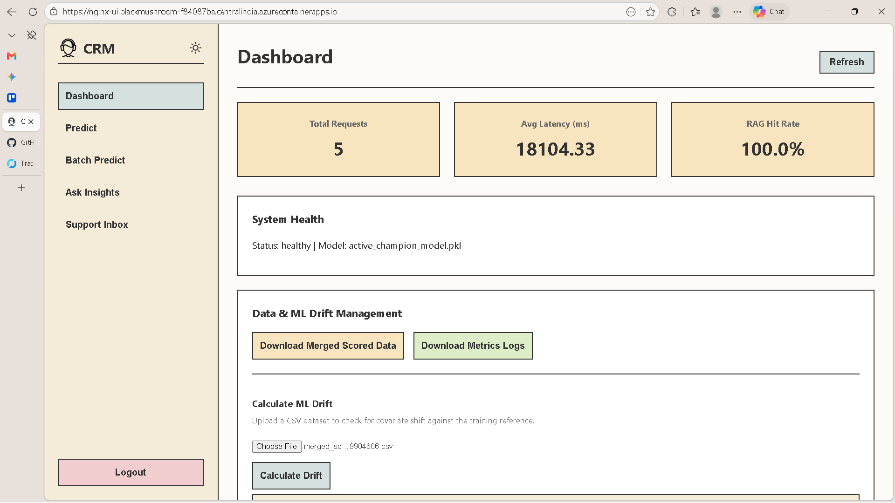
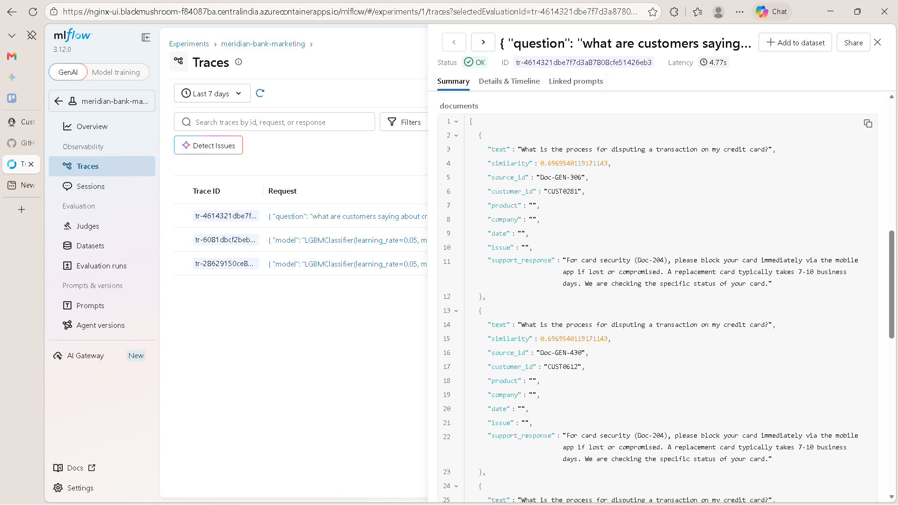
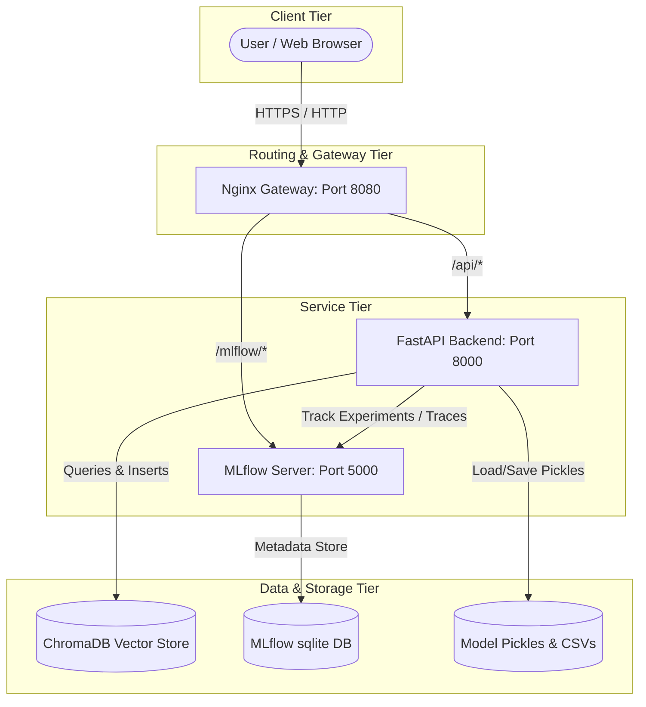
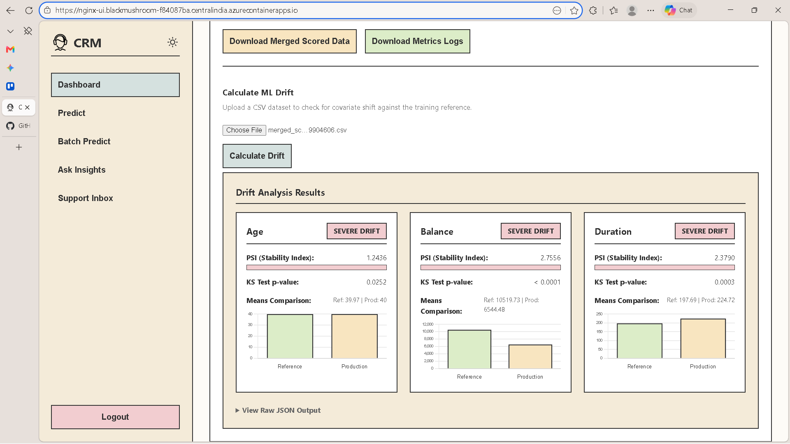
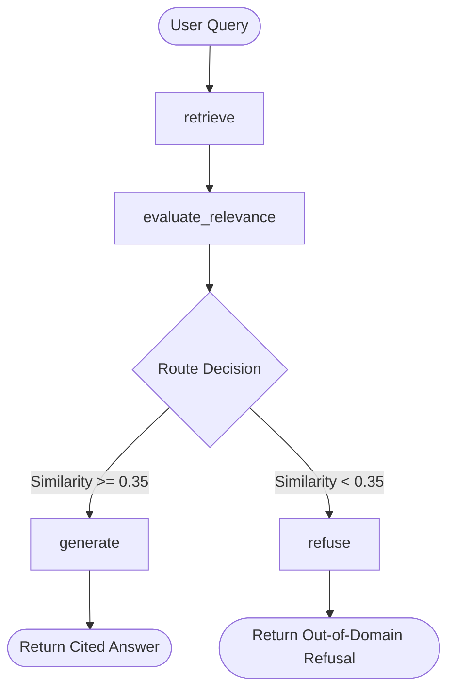
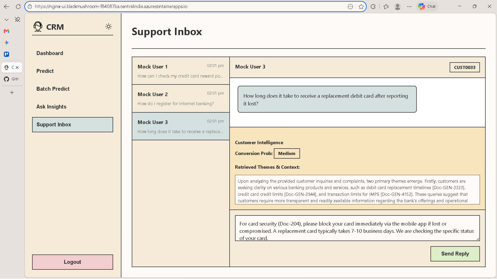
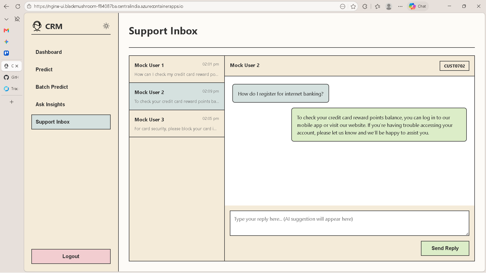
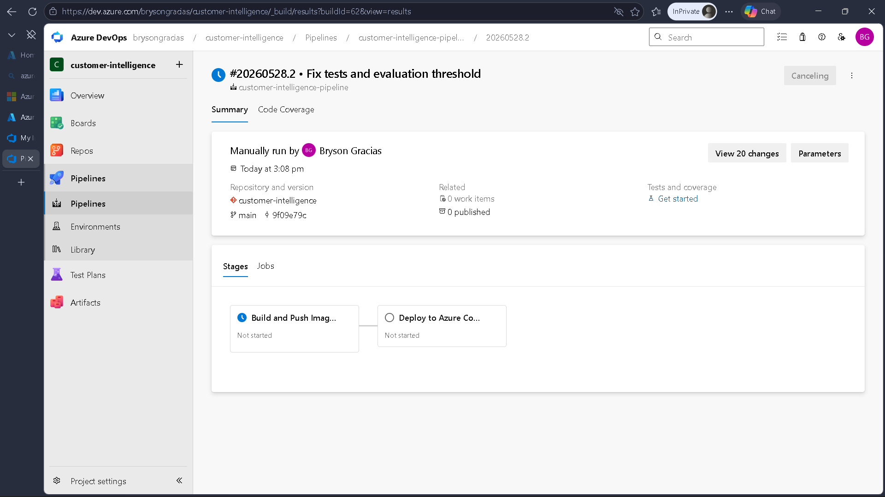

# Meridian Customer Intelligence Platform

The **Meridian Customer Intelligence Platform** is an enterprise-grade AI system that integrates predictive machine learning and generative Retrieval-Augmented Generation (RAG) capabilities to analyze customer behaviors and support requests. 

Leveraging a modular multi-container architecture fronted by a single-origin reverse proxy gateway, the platform facilitates:
1. **Predictive ML Lane**: Classifies customer conversion likelihood using structured demographic and behavioral data (LightGBM vs. Logistic Regression baseline with a relative promotion gate).
2. **Generative RAG Lane**: Analyzes customer complaints, retrieves contextually similar historic records from a ChromaDB vector store, and synthesizes grounded, cited responses via a stateful LangGraph agent.


---

## Live Deployment

The platform is deployed and running on Azure Container Apps:
* **demo URL**: https://www.loom.com/share/011371ba99f0447e9c299dbaf7236f31
* **Live Application URL**: [https://nginx-ui.blackmushroom-f84087ba.centralindia.azurecontainerapps.io/](https://nginx-ui.blackmushroom-f84087ba.centralindia.azurecontainerapps.io/)
* **MLflow Tracing & Observability Portal**: [https://nginx-ui.blackmushroom-f84087ba.centralindia.azurecontainerapps.io/mlflow/#/experiments/1/traces](https://nginx-ui.blackmushroom-f84087ba.centralindia.azurecontainerapps.io/mlflow/#/experiments/1/traces)





---

## Demo Video

Watch the platform walkthrough and demonstration video:
* [Google Drive Walkthrough Video](https://drive.google.com/file/d/1d4b3FLCFSxIuEpy5EjUSMoTCoS2nWaAW/view?usp=sharing)
* Local walkthrough asset: `loom-demo.mp4`

---

## System Architecture

The platform uses a microservices topology designed for secure, low-latency, and cross-origin-safe communication under a single-origin public gateway.



### Core Architecture Design Patterns
* **Separation of Concerns**: Decouples schema validation definitions (`pandera`), data ingestion pipelines (`pandas`), model training loops (`scikit-learn`/`LightGBM`), RAG state machines (`langgraph`), and serving layers (`fastapi`).
* **Fail-Safe Orchestration**: Inference handlers load the promoted active model (`active_champion_model.pkl`) with dynamic sequential fallback guards to ensure 100% API availability under local storage faults:
  $$\text{active\_champion\_model.pkl} \longrightarrow \text{champion\_model.pkl} \longrightarrow \text{baseline\_model.pkl} \longrightarrow \text{SafeMockModel}$$
* **Dual-Loop MLflow Observability**: Harnesses MLflow twice-offline for hyper-parameter, metric, and curve logging during training, and online for low-latency stateful tracer logging during serving routing.
* **Single-Origin Proxying**: Utilizes an internal Nginx Gateway configuration to prevent Cross-Origin Resource Sharing (CORS) exceptions and aggregate resources under a unified root domain.

---

## Repository Layout & Code Modules

```text
├── .github/              # CI/CD workflows (GitHub Actions)
│   └── workflows/
│       └── ci.yml        # CI Pipeline running tests and validation
├── data/                 # Raw/processed datasets
├── deploy/               # Deployment scripts and CI/CD pipelines
│   ├── deploy.sh         # Provisions infra and deploys Docker containers to Azure ACA
│   ├── redeploy.sh       # Builds/pushes local changes with zero-downtime rolling updates
│   └── azure-pipelines.yml # CI/CD build configuration
├── docker/               # Microservice containers configuration
│   ├── Dockerfile.fastapi # Backend server configuration
│   ├── Dockerfile.mlflow  # Experiment telemetry registry configuration
│   └── Dockerfile.ui      # Nginx ingress gateway configuration
├── docs/                 # Platform architecture, deployment logs, and walkthroughs
├── src/                  # Central application codebase
│   ├── config.py         # Global environment variables and hyper-parameters
│   ├── data_pipeline/    # Declarative validators and ingestion logic
│   │   ├── ingest.py     # Schema checking pipeline execution
│   │   ├── validate.py   # Strict data validations using Pandera
│   │   ├── features.py   # Reusable feature engineering functions
│   │   ├── generate_synthetic_data.py # Synthetic data generation
│   │   └── add_inference2train_set.py # Feedback loop data integration
│   ├── training/         # Model training and promotion criteria
│   │   ├── train.py      # Baseline and champion training scripts
│   │   └── evaluate.py   # Model evaluation and promotion gate rules
│   ├── rag/              # Conversational agent and complaint context indexing
│   │   ├── build_index.py # PDF/CSV ingestion, embedding models, and ChromaDB inserts
│   │   ├── retrieve.py   # Standalone retrieval logic
│   │   ├── answer.py     # Generation and prompting logic
│   │   ├── langgraph_agent.py # Stateful LangGraph implementation
│   │   └── rag_eval.py   # Vector validation and out-of-domain refusal testing
│   └── serving/          # Unified HTTP APIs
│       ├── app.py        # Starlette mounting and application middleware
│       ├── schemas.py    # Strict API schemas via Pydantic
│       └── serve.py      # Predict, batch score, and complaint ask endpoints
├── monitoring/           # System drift and performance monitoring
│   ├── ml_drift.py       # ML drift detection and analysis
│   └── rag_monitor.py    # RAG pipeline monitoring metrics
├── tests/                # Automated test suites
│   ├── test_database.py
│   ├── test_local_service.py
│   └── test_rag.py
├── ui/                   # Web-based analytics interface
│   ├── index.html        # Main dashboard with Dark Mode and Metrics Export
│   ├── test.html         # Legacy index page accessible via login screen
│   └── README.md         # UI specific documentation
└── reflection.md         # Architecture reflections and design decisions
```

---

## Key Modules Deep-Dive

### 1. Data Validation & Ingestion (`src/data_pipeline/`)
* Built on **Pandera**, the ingestion engine guarantees strict structural and type validation at runtime:
  * Constraints positive integers on `age`.
  * Sanitizes categoricals for `education` (`primary`, `secondary`, `tertiary`, `unknown`).
  * Enforces non-empty constraints on textual customer `job` and `complaint` details.
  * Auto-coerces standard numeric types to block common pandas serialization exceptions.

### 2. Dual-Model Training & Relative Promotion Gate (`src/training/`)
* **Baseline Model**: Fast Logistic Regression using standardized preprocessing.
* **Champion Model**: Advanced gradient-boosted trees via LightGBM.
* **Relative Promotion Gate (`evaluate.py`)**: Prior to system registration, champion weights are held to strict evaluation gates:
  1. **PR-AUC Improvement**: Champion's PR-AUC score must outperform the Baseline's by $\ge 0.03$.
  2. **F1-Score Degradation**: Champion's F1-Score must not degrade by $> 0.02$ relative to Baseline.
  * If these conditions fail, the pipeline returns exit code `1`, causing CI/CD builds to fail safely.



### 3. Stateful RAG & Out-of-Domain Refusal (`src/rag/`)
* Integrates `BAAI/bge-small-en-v1.5` embeddings mapping historic support complaints to a local **ChromaDB** index.
* Uses a stateful **LangGraph** orchestration graph:

* **Strict Grounded Generation**: Answers strictly reference original record source identifiers (e.g. `[Doc-101]`).
* **Zero-Hallucination Guardrails**: High-fidelity out-of-domain evaluation checks test refusal responses on out-of-distribution complaints to ensure a $100\%$ refusal rate.





---

## Running Locally

### Prerequisites
* Docker & Docker Compose
* An upstream NVIDIA API Key (if interacting with live LLMs; configured in `.env` based on `.env.example`):
  ```env
  NVIDIA_API_KEY=nvapi-your-key-here
  ```

### Startup Sequences
1. **Clone & Enter Directory**:
   ```bash
   cd customer-intelligence-main
   ```
2. **Boot the Containers**:
   ```bash
   docker compose up --build
   ```
   *(Add `-d` to run in detached daemon mode).*
3. **Validate Running Containers**:
   ```bash
   docker compose ps
   ```
4. **Interactive Interfaces**:
   * **Single-Origin Public Gateway**: [http://localhost:8080/](http://localhost:8080/)
   * **FastAPI Backend Documentation**: [http://localhost:8080/docs](http://localhost:8080/docs)
   * **MLflow Observability Portal**: [http://localhost:8080/mlflow/](http://localhost:8080/mlflow/)

---

## Deploying to Azure Container Apps (ACA)



Deployment infrastructure provisioning scripts reside in the `deploy/` directory.

### Initial & Targeted Provisioning
Authenticate with Azure and execute the deploy workflow. The deployment script has been modularized to allow targeted deployment of specific components:
```bash
az login
# Deploy all services (default)
bash deploy/deploy.sh all

# Or deploy selectively:
bash deploy/deploy.sh fastapi
bash deploy/deploy.sh mlflow
bash deploy/deploy.sh nginx
```

### Updating Existing Deployments (Redeploying)
For subsequent deployments after the initial provisioning, you should use the `redeploy.sh` script to properly trigger Azure Container App revisions. To ensure your latest commit is built and deployed, export the `IMAGE_TAG` dynamically:

```bash
# Update all services
bash -c 'export IMAGE_TAG=$(git rev-parse --short HEAD); bash deploy/redeploy.sh all'

# Or update selectively:
bash -c 'export IMAGE_TAG=$(git rev-parse --short HEAD); bash deploy/redeploy.sh fastapi'
bash -c 'export IMAGE_TAG=$(git rev-parse --short HEAD); bash deploy/redeploy.sh mlflow'
bash -c 'export IMAGE_TAG=$(git rev-parse --short HEAD); bash deploy/redeploy.sh nginx'
```
This automated shell workflow:
1. Provisions an Azure Resource Group in the target region (`centralindia`).
2. Generates an Azure Container Registry (ACR).
3. Connects an Azure Log Analytics Workspace with a Container Apps Environment.
4. Leverages local Docker compilation to bypass regional subscription ACR Task constraints.
5. Deploys three managed Container Apps: `nginx-ui` (public ingress), `fastapi-app` (internal ingress), and `mlflow-ui` (internal ingress).

### Ongoing Rolling Updates
Pushes local application modifications cleanly without infrastructure tear-down:
```bash
bash deploy/redeploy.sh
```

---

## Key Resolutions & Troubleshooting Reference

During cloud deployment, the following integration issues were encountered and resolved:

* **Subscription Restriction on ACR Tasks**: High-tier cloud task commands (`az acr build`) fail under restricted subscription levels (e.g. Azure for Students/Free).
  * *Fix*: Reconfigured `deploy.sh` to compile images using the local Docker Desktop daemon, execute `az acr login`, and push final images securely to the registry.
* **Windows Line Endings (`\r`) in Azure CLI**: Captured terminal output variables contained carriage returns (`\r\n`), causing image tags to break.
  * *Fix*: Sanitized all outputs with a pipeline string translator (`tr -d '\r'`).
* **Azure Container App Ingress Host Headers**: Nginx's default client host-propagation broke routing at the ACA ingress level, triggering `404 Not Found` responses.
  * *Fix*: Dynamic replacement was implemented in `nginx.conf.template` to explicitly pass internal ACA host bindings (`proxy_set_header Host ${FASTAPI_HOST}`).
* **Envoy SNI/Internal Resolution loops**: Hardcoded DNS resolvers bypassed Azure CoreDNS, preventing internal `.internal.` domain lookup.
  * *Fix*: Excluded the hardcoded Nginx `resolver` block, allowing Nginx to leverage the container's natural OS resolver (`/etc/resolv.conf`) to map back to internal virtual load balancers.
