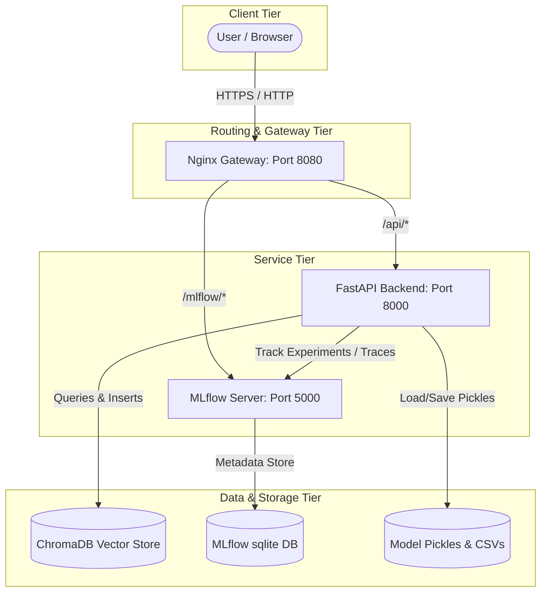

# Meridian Customer Intelligence Platform - System Architecture Document

This document provides a formal and concise architectural overview of the **Meridian Customer Intelligence Platform**, detailing its component structures, data pipelines, and design patterns.

---

## 1. System Overview

The Meridian Customer Intelligence Platform is an enterprise-grade AI system that integrates predictive machine learning and generative RAG (Retrieval-Augmented Generation) capabilities to analyze customer behaviors and support requests. 

The system leverages a modular multi-container architecture behind a single-origin reverse proxy gateway. It features two primary operational lanes:
1. **Predictive ML Lane**: Classifies customer conversion likelihood (using structured demographic and behavioral data).
2. **Generative RAG Lane**: Analyzes customer complaints, retrieves contextually similar historic records, and synthesizes grounded, cited responses or safely refuses out-of-domain queries.

---

## 2. Structural Architecture



---

## 3. Core Modules & Directory Layout (`/src`)

The codebase is organized into four main logic directories inside `src/`:

```text
src/
├── config.py             # Global environment configurations and hyper-parameters
├── data_pipeline/        # Data ingestion, schema enforcement, and validation
│   ├── ingest.py         # CSV reader wrapping Pandera validators
│   └── validate.py       # Decoupled Pandera declarative schema validation definitions
├── training/             # Scikit-learn/LightGBM model training and evaluation gates
│   ├── train.py          # Preprocessing and dual-model training (Baseline vs. Champion)
│   └── evaluate.py       # Relative promotion gate and pipeline execution checks
├── rag/                  # Retrieval-Augmented Generation using LangGraph & ChromaDB
│   ├── build_index.py    # Document parsing, embedding creation, and index construction
│   ├── langgraph_agent.py# Stateful agent graph defining Retrieve -> Evaluate -> Generate/Refuse nodes
│   └── rag_eval.py       # Offline evaluation suite verifying out-of-domain zero-hallucination thresholds
└── serving/              # Serving endpoints built on FastAPI
    ├── app.py            # Single-origin WSGI/ASGI mounting for FastAPI and MLflow
    ├── schemas.py        # Strict Pydantic models for request/response serialization
    └── serve.py          # Unified endpoint handlers, MLflow inference logger, and model loader
```

---

## 4. Module Details & Logic Flow

### A. Data Ingestion & Validation (`src/data_pipeline/`)
* **`validate.py`**: Defines a strict `CustomerSchema` using `pandera`. It enforces:
  * Positive integer constraint for `age`.
  * Standard categoricals for `education` (`primary`, `secondary`, `tertiary`, `unknown`).
  * Non-empty strings for `job` and `complaint`.
  * Non-negative constraint for last contact `duration`.
  * Coercion of types to prevent downstream pandas exceptions.
* **`ingest.py`**: Reads incoming data from CSV files and runs the Pandera schema checker.

### B. Machine Learning & Promotion Gate (`src/training/`)
* **Preprocessing**: Encodes job titles and education levels to static structural codes (`job_code`, `edu_code`) using pre-defined mappings.
* **Dual-Model Training (`train.py`)**:
  * **Baseline Model**: Logistic Regression trained with Standard metrics.
  * **Champion Model**: LightGBM Classifier tuned for higher capacity representation.
  * Logs parameters, metrics (Accuracy, F1-Score, ROC-AUC, PR-AUC), and calibration curve graphs directly to MLflow.
* **Relative Promotion Gate (`evaluate.py`)**:
  * Prior to deploying models, evaluates both models on the evaluation dataset.
  * Enforces the **Relative Promotion Rules**:
    1. **PR-AUC Improvement**: Champion must beat the Baseline PR-AUC by at least `PROMOTION_PR_AUC_MIN_IMPROVEMENT` (default: `0.03`).
    2. **F1-Score Change**: Champion's F1-Score must not drop by more than `PROMOTION_F1_MAX_DROP` (default: `0.02`).
  * If rules are satisfied, the champion is promoted to `active_champion_model.pkl`. Otherwise, the script raises an error (exit code 1) to intentionally break the CI/CD pipeline and protect production.

### C. Retrieval-Augmented Generation (`src/rag/`)
* **Vector Store (`build_index.py`)**: Extracts historical customer complaints from the training dataset, encodes them into high-dimensional vectors via HuggingFace's `BAAI/bge-small-en-v1.5` embeddings, and indexes them in a persistent `ChromaDB` collection.
* **Stateful Agent Graph (`langgraph_agent.py`)**:
  Assembles a stateful graph (`AgentState`) using `langgraph` containing the following nodes:
  1. **`retrieve`**: Performs similarity query in ChromaDB.
  2. **`evaluate_relevance`**: Computes max cosine similarity.
  3. **`route_relevance` (Router)**: Routes queries depending on whether they pass the `RAG_SIMILARITY_THRESHOLD` (default: `0.35`):
     * If **Passed**: Directs to the `generate` node.
     * If **Failed**: Directs to the `refuse` node.
  4. **`refuse`**: Generates a standard out-of-domain response: `"Refused: Evidence insufficient to ground an answer."`
  5. **`generate`**: Interfaces with the upstream `ChatNVIDIA` (or high-fidelity mock) to synthesize answers that strictly cite source IDs (e.g. `[Doc-101]`).
* **Offline Evaluation (`rag_eval.py`)**: Executes an automated pipeline over a suite of 15 standard queries (10 in-domain, 5 out-of-domain) and asserts a **100% Out-of-Domain Refusal Rate** to prevent hallucination.

### D. Serving Layer (`src/serving/`)
* **FastAPI App Mounting (`app.py`)**: Runs ASGI/WSGI mounting to expose the FastAPI server at `/api/`, the MLflow Dashboard at `/mlflow/`, and a static UI from `/` under a single port.
* **Endpoints (`serve.py`)**:
  * `/health`: Reports database integrity, Chroma index status, and active ML model version.
  * `/predict`: Scores single records after validating via Pandera.
  * `/batch-score`: Accepts CSV uploads for high-throughput batch inference.
  * `/ask-complaints`: Runs the LangGraph agent for conversational complaint analysis.
  * `/customer-intel` (Unified): Coordinates execution of both the predictive ML lane and the LangGraph RAG agent in a single payload.

---

## 5. Key Architecture Design Patterns

1. **Separation of Concerns**: Data verification schemas (`validate.py`) are strictly isolated from ingestion logic (`ingest.py`) and serving endpoints (`serve.py`).
2. **Fail-Safe Orchestration**: Endpoint modeling loads the `active_champion_model.pkl` with a sequential fallback strategy (`champion_model.pkl` -> `baseline_model.pkl` -> `SafeMockModel`) to guarantee serving reliability under file-system faults.
3. **Dual-Loop MLflow Observability**: Employs MLflow twice: for *offline tracking* (logging parameters, metric curves, artifacts during training) and for *online tracing* (capturing step-level telemetry, latencies, and agent spans during serving inference).
4. **Single-Origin Topology**: Leverages an Nginx Gateway (or Starlette/WSGI sub-mounting) to address CORS restrictions and consolidate services under a unified domain name.
