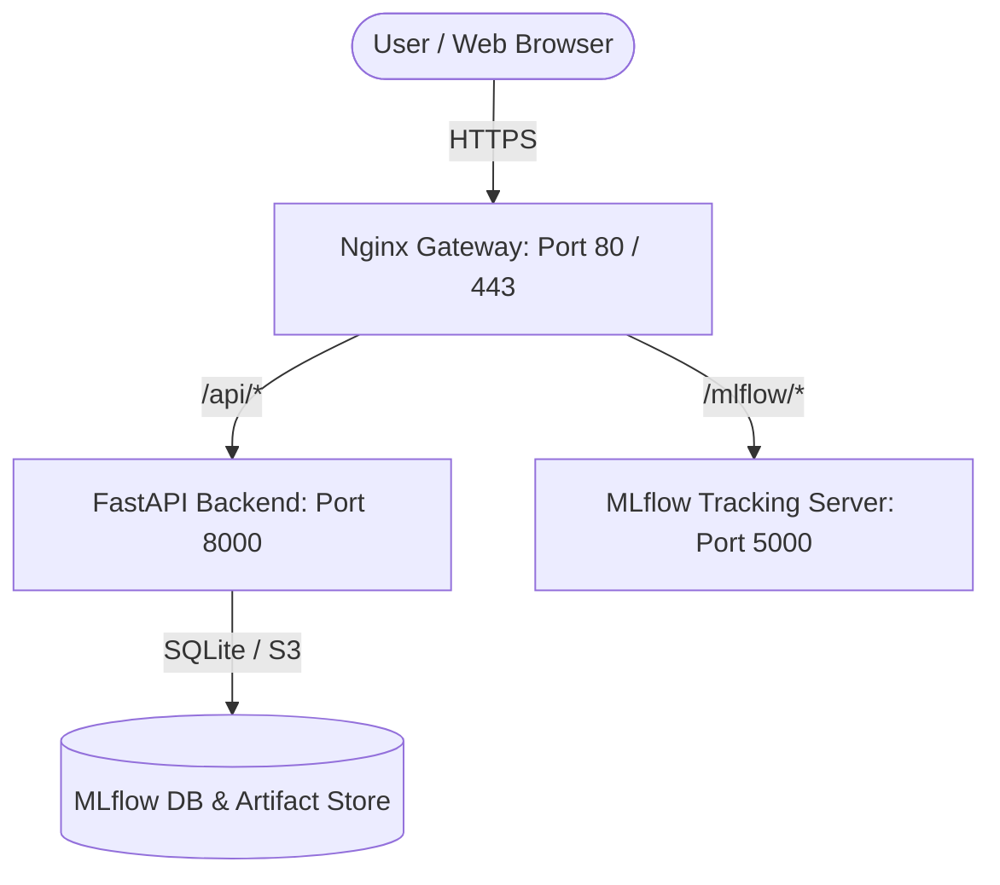

# Docker & Cloud Deployment Architecture

This document provides a formal overview of the containerization and cloud deployment setup for the Customer Intelligence codebase. 

---

## 1. System Architecture

The application is designed using a modular, multi-container microservices architecture. To bypass cross-origin resource sharing (CORS) complications and facilitate a unified entry point, all services are served under a single origin behind a public Nginx Gateway.



### Components:
* **FastAPI Backend (`fastapi-app`)**: Houses core intelligence logic, RAG pipelines, API services, and routes logs/traces to the MLflow instance.
* **MLflow Server (`mlflow-ui`)**: Captures training metrics, tracks RAG query runs, logs LLM traces, and provides the visual experiment dashboard.
* **Nginx Gateway (`nginx-ui`)**: Serves as the reverse proxy. It routes traffic internally to the FastAPI backend and the MLflow UI.

---

## 2. Container Configuration (`docker/`)

All Docker configurations are organized within the `docker/` directory:

| Dockerfile | Target Service | Base Image | Purpose / Description |
| :--- | :--- | :--- | :--- |
| [`Dockerfile.fastapi`](../docker/Dockerfile.fastapi) | `fastapi-app` | `python:3.11-slim` | Builds the FastAPI app, installs dependencies via `pip`, and runs the application using `uvicorn`. |
| [`Dockerfile.mlflow`](../docker/Dockerfile.mlflow) | `mlflow-ui` | `python:3.11-slim` | Configures and starts the MLflow server on port `5000` with support for SQLite backend stores. |
| [`Dockerfile.ui`](../docker/Dockerfile.ui)| `nginx-ui` | `nginx:alpine` | Installs `gettext` for environment variable injection, copies the `nginx.conf.template`, and serves the frontend dashboard. |

---

## 3. Step-by-Step: Running Locally

Follow these sequential steps to run the complete multi-container stack on your local machine:

### Prerequisites:
* **Docker & Docker Compose**: Ensure Docker Desktop is installed and running.
* **Environment Configuration**: Create a `.env` file in the root directory (based on `.env.example`) and configure your secrets, especially your `NVIDIA_API_KEY`:
  ```env
  NVIDIA_API_KEY=nvapi-your-key-here
  ```

### Steps:
1. **Navigate to Repository Root**:
   ```bash
   cd customer-intelligence-main
   ```
2. **Build and Start the Containers**:
   Spin up the entire stack in the foreground to monitor live logs:
   ```bash
   docker compose up --build
   ```
   *(Add `-d` flag if you want to run in detached background mode: `docker compose up --build -d`)*
3. **Verify running containers**:
   Check that all three containers are healthy and running:
   ```bash
   docker compose ps
   ```
4. **Access the Services**:
   * **Nginx Gateway (Unified Single-Origin Entry)**: `http://localhost:8080/`
   * **FastAPI Interactive API docs**: `http://localhost:8080/docs` (or directly via API port `http://localhost:8000/docs`)
   * **MLflow Tracking Dashboard**: `http://localhost:8080/mlflow/`
5. **Teardown**:
   To stop the services and clean up network resources:
   ```bash
   docker compose down
   ```

---

## 4. Step-by-Step: Deploying on Azure

Follow this sequence to deploy the microservices stack to Azure Container Apps (ACA):

### Prerequisites:
* **Azure CLI**: Make sure the [Azure CLI](https://learn.microsoft.com/en-us/cli/azure/install-azure-cli) is installed.
* **Active Subscription**: Log into your Azure account:
  ```bash
  az login
  ```
* **Environment File**: Ensure `NVIDIA_API_KEY` is specified in your `.env` file in the repository root.

### Sequence A: Initial Infrastructure & First-Time Deployment
1. **Initialize and Provision (or Targeted Deploy)**:
   Run the primary deployment script. This script automatically registers necessary Azure resource providers, creates a Resource Group, provisions the Azure Container Registry (ACR), sets up Log Analytics workspaces, generates the secure Container Apps Environment, builds the Docker images, and deploys the three Container Apps. It also supports targeted deployment of individual components:
   ```bash
   # Deploy all services (default)
   bash deploy/deploy.sh all

   # Or deploy selectively:
   bash deploy/deploy.sh fastapi
   bash deploy/deploy.sh mlflow
   bash deploy/deploy.sh nginx
   ```
2. **Retrieve Deployment URLs**:
   At the end of a successful run, the script will output the secure endpoints matching your newly deployed system:
   ```text
   ╔══════════════════════════════════════════════════════════════╗
   ║                      Deployment Complete                     ║
   ╠══════════════════════════════════════════════════════════════╣
   ║  UI + API Gateway : https://nginx-ui.your-unique-sub.domain  ║
   ║  MLflow UI        : https://nginx-ui.your-unique-sub.domain/mlflow/
   ║  API (direct)     : https://nginx-ui.your-unique-sub.domain/api/health
   ╚══════════════════════════════════════════════════════════════╝
   ```

### Sequence B: Incremental Code Updates (Redeployment)
If you modify your FastAPI Python code, frontend HTML files, or Nginx templates, you can push updates without resetting any of the cloud infrastructure:
1. **Run the Redeployment Script**:
   ```bash
   bash deploy/redeploy.sh
   ```
   This script builds and pushes the updated images, registers new Container App revisions (triggering rolling updates), and performs automated curl health checks to verify that the app successfully stabilizes.

### Sequence C: Automated CI/CD (GitHub/Azure Pipelines)
* On every merge or push to the `main` branch, the `.github/workflows/ci.yml` pipeline executes automated tests, linting, and data validation.
* Additionally, [azure-pipelines.yml](../deploy/azure-pipelines.yml) compiles containers via ACR remote builds and updates running Container Apps with zero-downtime rolling updates.

