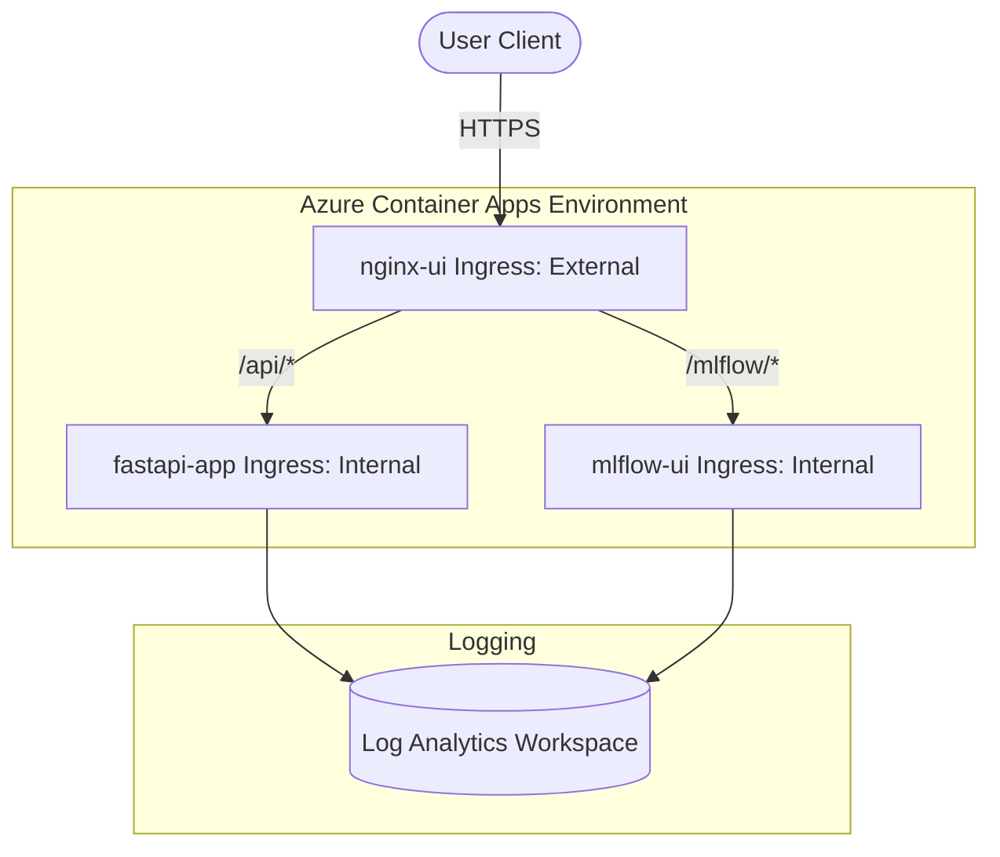

# Azure Deployment Walkthrough

The application has been successfully deployed to Azure Container Apps! Below is a summary of the deployment, the issues we encountered, how we resolved them, and the resulting live endpoints.

---

## Live Endpoints

All services are running same-origin behind Nginx acting as the secure reverse proxy / API Gateway. This prevents any CORS issues.

*   **UI + API Gateway (Frontend):** [https://nginx-ui.blackmushroom-f84087ba.centralindia.azurecontainerapps.io](https://nginx-ui.blackmushroom-f84087ba.centralindia.azurecontainerapps.io)
*   **MLflow UI:** [https://nginx-ui.blackmushroom-f84087ba.centralindia.azurecontainerapps.io/mlflow/](https://nginx-ui.blackmushroom-f84087ba.centralindia.azurecontainerapps.io/mlflow/)
*   **API Health (Backend):** [https://nginx-ui.blackmushroom-f84087ba.centralindia.azurecontainerapps.io/api/health](https://nginx-ui.blackmushroom-f84087ba.centralindia.azurecontainerapps.io/api/health)

---

## Errors Addressed & Solutions

During the deployment process, three key errors were identified and resolved to ensure a robust and successful deployment:

### 1. Subscription Restriction on Azure Container Registry (ACR) Tasks
*   **Error Encountered:** 
    ```
    ERROR: (TasksOperationsNotAllowed) ACR Tasks requests for the registry meridianciacr are not permitted.
    ```
*   **Root Cause:** Cloud-based ACR build tasks (`az acr build`) are disabled on certain subscription levels (such as Azure for Students or Free Trials) in some regions.
*   **Resolution:** Modified the script to launch your local Docker Desktop engine, authenticate via `az acr login`, and build the three containers (`fastapi`, `mlflow`, `nginx-ui`) locally on your machine before pushing them to ACR. Docker's smart layer caching kept subsequent builds/pushes extremely fast!

### 2. Windows Carriage Return Characters (`\r`) in Azure CLI Outputs
*   **Error Encountered:** 
    ```
    ERROR: failed to build: invalid tag "meridianciacr.azurecr.io\r/fastapi:latest": invalid reference format
    ```
*   **Root Cause:** Running Bash on Windows captures the standard output of the Azure CLI with Windows line endings (`\r\n`), inserting a trailing `\r` (carriage return) into shell variables.
*   **Resolution:** Sanitized all captured CLI output variables (such as `ACR_SERVER`, `WORKSPACE_ID`, `SHARED_KEY`, and `UI_FQDN`) in `deploy.sh` by piping them through `tr -d '\r'` before use.

### 3. Invalid Log Analytics Workspace Parameter Format
*   **Error Encountered:** 
    ```
    ERROR: (InvalidRequestParameterWithDetails) LogAnalyticsConfiguration.CustomerId is invalid. CustomerId must be a GUID.
    ```
*   **Root Cause:** The script queried the full Azure Resource ID (`id` property) for the workspace instead of the specific GUID-formatted Workspace Customer ID (`customerId` property).
*   **Resolution:** Changed the `--query` target from `id` to `customerId` during workspace creation to pass the correct GUID to `az containerapp env create`.

### 4. Invalid Container App Ingress Arguments
*   **Error Encountered:** 
    ```
    ERROR: unrecognized arguments: false
    ```
*   **Root Cause:** The script attempted to disable public ingress using `--ingress external false`, which is invalid syntax in the CLI.
*   **Resolution:** Correctly defined internal-only routing by changing the ingress parameters to `--ingress internal` for both `fastapi-app` and `mlflow-ui`.

### 5. MLflow UI CORS / Cross-Origin Request Blocking
*   **Error Encountered:** In the `mlflow-ui` logs, we saw `403 Forbidden` for requests like `POST /ajax-api/3.0/mlflow/traces/metrics` with the error `WARNING mlflow.server.fastapi_security: Blocked cross-origin request from https://nginx-ui...`.
*   **Root Cause:** Starting with MLflow 2.14+, the server includes built-in security middleware enforcing CORS and Host validation, which blocks requests proxied through different origins (like our Nginx public gateway).
*   **Resolution:** Configured the `MLFLOW_SERVER_CORS_ALLOWED_ORIGINS` environment variable to `"*"` on the MLflow container app (and updated local configuration/deploy scripts for future deployments). This instantly unblocked cross-origin requests and allowed experiment data and traces to load in the MLflow UI.

---

## Provisioned Architecture



All resources are configured securely, keeping the API and model registry internal to the Azure Container Apps environment and exposing only the secure Nginx web gateway to the public.
